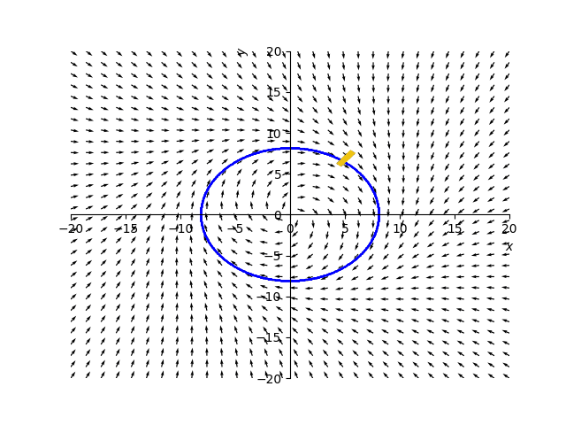

# Guiding Vector Control given implicit function

Implementation of path following algorithm given the implicit function based on 
https://www.sciencedirect.com/science/article/pii/S2405896317318748

Since the mentioned algorithm requires paths to be written
as implicit function, two ways of converting set of points
to the implicit function are implemented:

1. Implication using RBF functions
2. Implication using Fourier elliptics (uses [PyEFD](https://github.com/hbldh/pyefd))

## Testing
Run test with Pytest

## References
[1] Y.A.Kapitanyuk, A.V.Proskurnikov and M.Cao, [A guiding vector field algorithm for path
    following control of nonholonomic mobile robots](https://arxiv.org/pdf/1610.04391.pdf)

[2] G.Turk and J.F.O’Brien, [Shape Transformation Using Variational Implicit Functions](https://faculty.cc.gatech.edu/~turk/my_papers/schange.pdf)

[3] H.Yalcin, M.Unel and W.Wolovich, [Implicitization of Parametric Curves by Matrix Annihilation](https://www.cs.cmu.edu/~hulya/Publications/ICIP02Paper.pdf)

## TODOs
- Fix width offset (look at plots!)
- Add setup.py
- Fix/simplify plotting
- More comments in implicators
- Tests